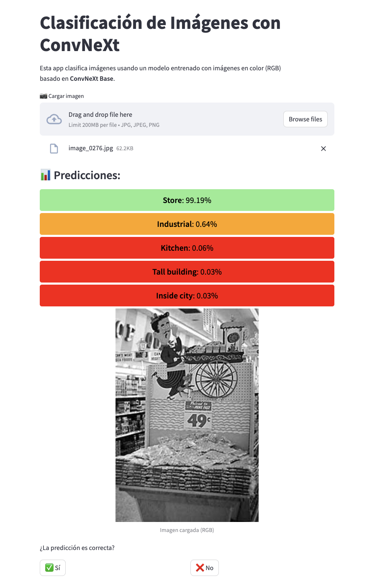

# **Maching Learning II course**

# **Deep Learning project**

## **Canonist.ia**

El objectivo de este proyecto es aplicar transfer learning a un caso de negocio simulado de portales inmobiliarios y desplegar el modelo en una aplicación Streamlit accesible públicamente.

El proyecto consiste en recibir una imagen y clasificarla según su entorno (habitación, cocina,bosque,indistria, ...), utilizando diversas CNN preentrenadas que se ajustarán en función a nuestras necesidades. Para ello, se entrenarán los modelos empleando la web de Weights & Biases, donde se reportarán de manera detallada todas las métricas relevantes y al mismo tiempo nos servirá para hacer una comparativa de modelo. Una vez listo, el modelo se integrará en una aplicación Streamlit que permitirá a los usuarios cargar imágenes y obtener una clasificación de forma amigable y en tiempo real.

This project was undertaken as part of the Maching Learnning course within the Big Data Master's Degree program at Comillas ICAI University.

The team responsible for the project includes:

| Name                       | Email                           |
| -------------------------- | ------------------------------- |
| Marta Álvarez Fernández    | 202402675@alu.comillas.edu      |
| Leticia Cólgan Valero      | leticiacologan@alu.comillas.edu |
| Ana Vera Peña              | 202416868@alu.comillas.edu      |
| Antonio Bajo Gómez-Madurga | 202410510@alu.comillas.edu      |

## **Previous requirements**

1. Clone the repository

```bash
git clone https://github.com/martaalvarezfer/Project_Grupo6_MlII.git
```

2. Create a venv & install the necessary libraries

```bash
cd Project_Grupo6_MlII
python -m venv venv
source venv/bin/activate
pip install --upgrade pip
pip install -r requirements.txt
```

3. If necessary, update .gitignore with your own sensitive files

## **Folders**

- src: contiene dos carpetas:
  . proyect: contiene el script con que que se han llevado a cabo los entrenamientos y las clase CNN, para los modelos efficientnet se ultiza otra. Tambien contiene un script(comp.py) con que el poder obtener un csv para poder ver que es lo que peor detecta nuestro modelo. Dicho csv depues se le puede pasar al scrip (res.py) que casa la matriz de confusión con los top 10 donde más se equivoca nuestro modelo

      . streamlit: contiene el script que permite ejecutar y lanzar la app

- models: contiene los archivos .pt que es un fichero binario con los pesos de los modelos entrenados de los cuales hemos obtenido mejores resultados
- dataset: Folder containing all the inputs used for the model.
- wandb: As all the info of the models is reported to W&B.

⚠️ Importante
Como los archivos de los modelos superan los 100 MB, GitHub no permite subirlos (y tampoco logramos almacenarlos en Weights & Biases).

Para que la aplicación Streamlit funcione correctamente con los pesos entrenados, tendrás que descargarlos desde la siguiente carpeta de Google Drive y colocarlos manualmente en el directorio models de tu proyecto:

## **Modelos entrenados**

Puedes observar los modelos entrenados y sus métricas en el siguiente link: https://wandb.ai/MLII-Grupo6-2025/MLII-Grupo6-2025?nw=nwuser<user_number> destacamo este modelo de los entrenados, que es el que usamos en la app:

_ConvNeXt Base entrenado con Cross-Entropy Loss_:
Este modelo ha sido seleccionado como el mejor entre todos los entrenados. Se ha utilizado la arquitectura ConvNeXt Base, preentrenada en ImageNet, y ajustada mediante fine-tuning con las últimas 5 capas descongeladas. Usando la función de pérdida Cross-Entropy Loss y el optimizador Adam, con un learning rate: 0.0001 sobre un tamaño de imagen de 224x224 píxeles y durante 7 épocas. Precisión en entrenamiento: 91.06%. Precisión en validación: 93.60% .Pérdida en entrenamiento: 0.275. Pérdida en validación: 0.178

Sabemos que nuestro modelo no es igual de bueno predicciendo los diferentes tipos de entorno presenta sus mayores dificultades a la hora de diferenciar entre habitaciones visualmente similares. Las principales confusiones se producen entre:

- Bedroom y Living room
- Office y Kitchen

Esto sugiere que el modelo tiende a fallar cuando se trata de interiores con elementos comunes, como muebles, iluminación o distribución espacial. Estas confusiones podrían deberse a la similitud visual entre estas clases en el conjunto de datos.

## **App**

Los modelos antes citados pueden probarse en la app. Para lanzar la app debes:

```bash
streamlit run src/streamlit/app.py
```

### Example: App



## **Mejoras a implementat**

A lo largo del proyecto y una vez finalizado este podemos identificar posibles mejoras:

1. Precision modelos

2. Añadir variedad a los datos
   Haciendo rotaciones o escalar las imágenes para aumentar el conjunto de datos

3. Modelos a segundo nivel

Hemos detectado que nuestros modelos son mejores en cierto tipo de imagen que en otras, es decir en algunas no presenta un porcentaje alto de confianza en ninguna de ellas. Por tanto estas dudodas se pasarían a submodelos que están especializados en diversos tipos de imágenes y se seleccionaria el que presente el mayor porcentaje de confianza. Por tanto podríamos aplicar un primer modelo que detecte. Esta técnica puede aumentar la precisión general, porque permite hacer predicciones más cuidadosas y específicas en los casos más difíciles, en lugar de forzar una decisión poco segura con el modelo principal.

4. Probar modelos con GPU

Una limitación que hemos tenido es carecer de GPUs en ninguno de los ordenadores y la opción de GPU que ofrece google drive no erá suficiente, por tanto modelos como resnext101_64x4d solo los hemos podido probar con pocas épocas.

5. Descongelas capas concretas

En lugar de entrenar a ciegas partes del modelo, decides cuáles partes realmente necesitan aprender para adaptarse a tu tarea. Este aspecto fue el que probamos una vez vista nuestra limitación con la GPU, obteniendo buenos resultado con modelos menos pesados como efficientnet_b4 o efficientnet_b5.

6. Customizar la función de perdida
   Otra idea no implementada por tiempo, es adaptar la función de perdida a las necesidades específicas de nuestro modelo

Queremos concluir con la idea de que realizar este proyecto nos ha permitido acercarnos a un modelo en producción, pudiendo monitorizar nuestras métricas e incluir nuestro mejores modelos en un MVP final.
